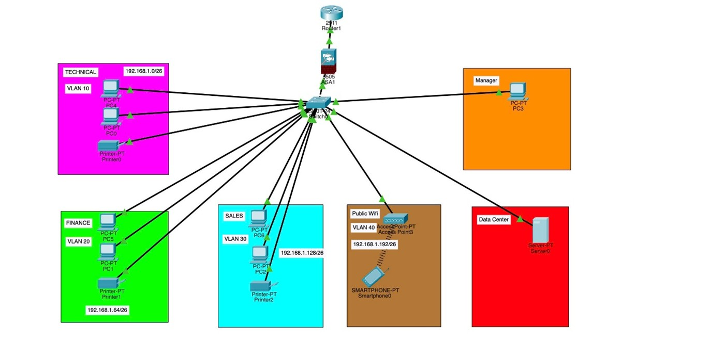
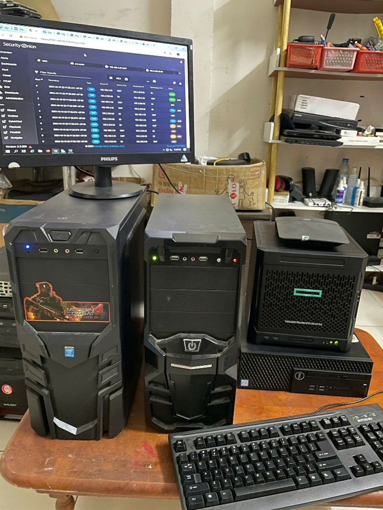
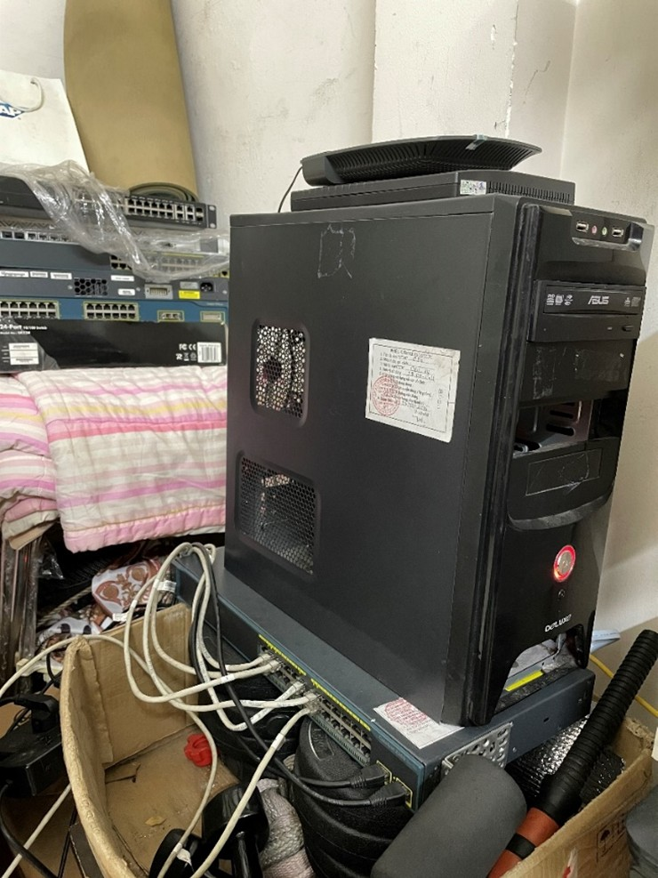

# 1. Thiết kế mạng doanh nghiệp SMEs

## 1.1 Sơ đồ tổng quan

**Hình 1**: Sơ đồ thiết kế hệ thống mạng cho doanh nghiệp vừa và nhỏ.

## 1.2 Thành phần chính
- **Router**: Kết nối mạng nội bộ với Internet.
- **Switch**: Chia VLAN cho Office, Tech, WiFi.
- **Firewall OPNsense**: Bảo mật lớp mạng.
- **Server**: AD, DNS, Splunk, OpManager.
- **Security Onion**: Giám sát & phát hiện xâm nhập.

---

## 1.3 Máy chủ và trung tâm dữ liệu

**Hình 2**: Server triển khai các thành phần chính.

### Bao gồm:
1. Server cho **Security Onion**  
2. Server quản lý hệ thống & giám sát hoạt động  
3. Trung tâm dữ liệu (**Datacenter**)  
4. Máy chủ ảo hóa **Proxmox**  

---

## 1.4 Thiết bị mạng và phần cứng

**Hình 3**: Router, WiFi, Firewall và Switch.

### Bao gồm:
5. Thiết bị **WiFi** cho người dùng  
6. **Router** kết nối Internet  
7. **Firewall chuyên dụng** cho OPNsense  
8. **Switch Cisco** chia VLAN cho nội bộ công ty  

