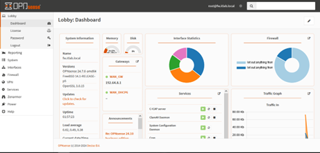
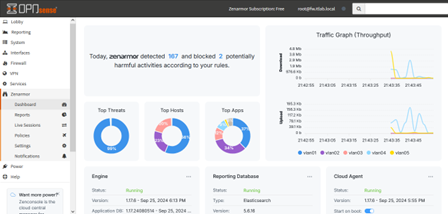
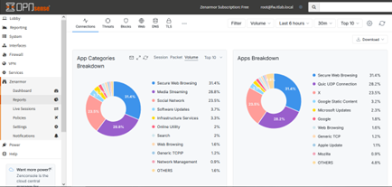
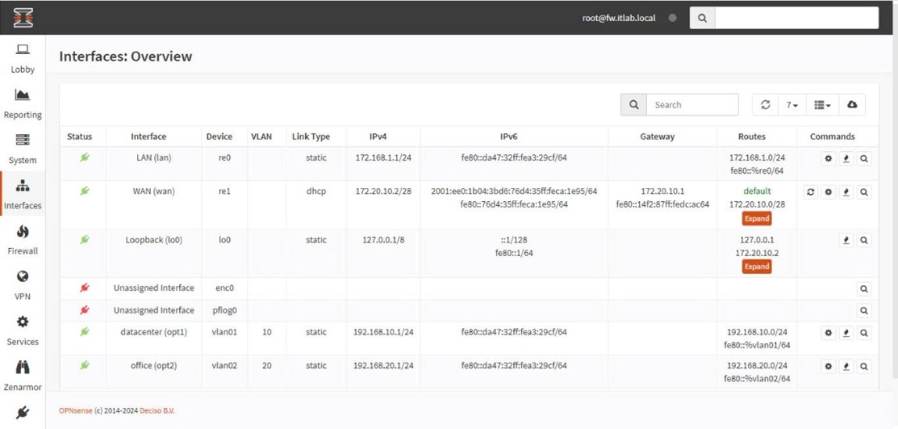
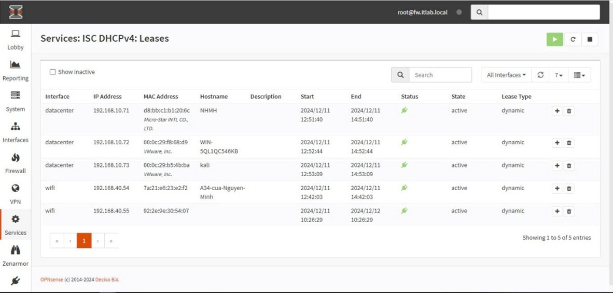
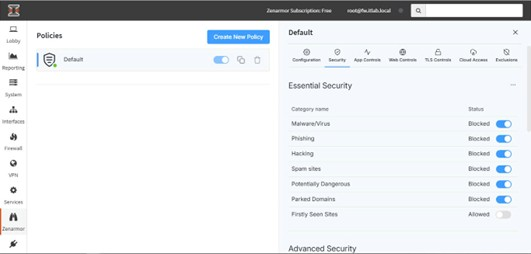

# 2. Firewall OPNsense

## 2.1 Triển khai
Cài đặt **OPNsense** trên máy ảo (Proxmox, VMware, VirtualBox) hoặc trên phần cứng firewall chuyên dụng.

---

## 2.2 Cấu hình cơ bản
- Đặt địa chỉ **IP WAN/LAN**.  
- Thêm rule cho phép **LAN → WAN**.  
- Tạo rule **chặn port nguy hiểm** (ví dụ: Telnet, SMB).  

---

## 2.3 Minh họa giao diện OPNsense

  
**Hình 1**: Giao diện trang chủ của OPNsense  

  
**Hình 2**: Giao diện Dashboard của OPNsense  

  
**Hình 3**: Giao diện Report của OPNsense  

  
**Hình 4**: Giao diện *Interface: Overview* của OPNsense  

  
**Hình 5**: Giao diện *Services: ISC DHCPv4: Lease* của OPNsense  

  
**Hình 6**: Giao diện *Zenarmor: Policies* của OPNsense  

---

## 2.4 VPN
Cấu hình **VPN site-to-site** hoặc **remote access** để nhân viên có thể làm việc từ xa an toàn.

hướng dẫn cài đặt tại [install/opnsense_install.md](../install/opnsense_install.md)