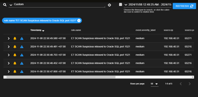

# 3. IDS/IPS với Security Onion

## 3.1 Giới thiệu
**Security Onion** là một hệ điều hành mã nguồn mở dùng để:
- Giám sát an ninh mạng (Network Security Monitoring).
- Phát hiện xâm nhập (IDS/IPS) với Suricata và Zeek.
- Phân tích log và sự kiện bảo mật.
- Cung cấp dashboard trực quan thông qua Kibana.

---

## 3.2 Triển khai
- Cài đặt Security Onion trên máy chủ vật lý hoặc máy ảo (**Proxmox/VMware**).
- Card mạng 1: **Management** (quản trị).  
- Card mạng 2: **Monitoring** (thu thập lưu lượng từ VLAN/switch).  
- Có thể tích hợp với hệ thống log tập trung (**Splunk**).

Xem hướng cài đặt tại: [install/securityonion_install.md](../install/securityonion_install.md)

---

## 3.3 Giao diện quản lý

  
**Hình 1**: Giao diện đăng nhập Security Onion  

  
**Hình 2**: Dashboard giám sát lưu lượng  

  
**Hình 3**: Cảnh báo IDS/IPS trong Security Onion  

---

## 3.4 Cảnh báo mẫu
Security Onion có thể phát hiện nhiều loại tấn công:
- **Brute force SSH**  
- **ICMP abnormal traffic** (ping flood, covert channel)  
- **Malware beaconing**  
- **Port scanning**  

---

## 3.5 Kết hợp với hệ thống
- Tích hợp với **Splunk** để phân tích nâng cao.  
- Kết hợp với **OPNsense Firewall** để phản ứng (block IP, cảnh báo admin).  
