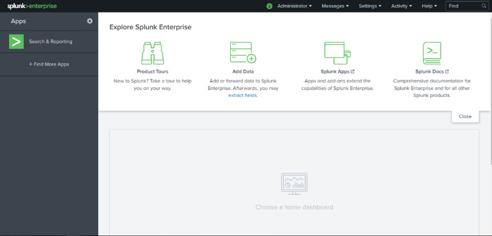
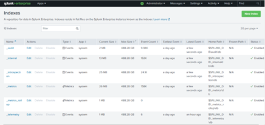

# 4. Quản lý log & phân tích sự kiện với Splunk

## 4.1 Giới thiệu
**Splunk** là nền tảng thu thập, lưu trữ và phân tích log tập trung, giúp:
- Giám sát hoạt động hệ thống và ứng dụng.
- Phân tích sự kiện an ninh mạng.
- Xây dựng dashboard trực quan để cảnh báo.

---

## 4.2 Triển khai
- Cài đặt Splunk trên máy chủ Linux/Windows.  
- Tích hợp với firewall (OPNsense), AD, Security Onion để thu thập log.  
- Tạo **Index** và **Sourcetype** để phân loại dữ liệu.  
- Thiết lập cảnh báo (alert) khi phát hiện sự kiện bất thường.  

hướng dẫn cài đặt tại: [install/splunk_install.md](../install/splunk_install.md)

---

## 4.3 Giao diện quản lý

  
**Hình 1**: Dashboard giám sát log trong Splunk  

  
**Hình 2**:Giao diện Indexes của Splunk 

---

## 4.4 Use Case bảo mật
Splunk có thể áp dụng trong nhiều tình huống:
- **Phát hiện đăng nhập bất thường** (log AD).  
- **Giám sát lưu lượng firewall** (log OPNsense).  
- **Phân tích sự kiện IDS/IPS** (log Security Onion).  
- **Tìm kiếm hành vi người dùng bất thường**.  

---

## 4.5 Kết hợp với hệ thống
- Thu thập log từ **Security Onion** để phân tích chuyên sâu.  
- Tích hợp với **OpManager** để giám sát hạ tầng.  
- Hỗ trợ đội SOC/IT trong việc **tìm kiếm và điều tra sự cố bảo mật**.  
