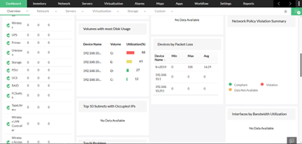
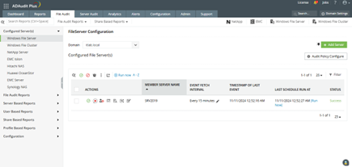

# 5. Quản lý Active Directory

## 5.1 Giới thiệu
**Active Directory (AD)** là dịch vụ quản lý tài khoản, máy tính và tài nguyên mạng trong doanh nghiệp.  
Để nâng cao khả năng quản lý và giám sát, dự án sử dụng:
- **AD Manager Plus**: Quản lý người dùng, nhóm, OU và policy.  
- **AD Audit Plus**: Giám sát, audit và tạo báo cáo về các hoạt động trong AD.  

---

## 5.2 Triển khai
- Cài đặt AD Manager Plus và AD Audit Plus trên Windows Server.  
- Kết nối với domain Active Directory nội bộ.  
- Phân quyền cho admin theo Role-Based Access Control (RBAC).  
- Tạo policy giám sát đăng nhập thất bại, thay đổi group, thay đổi OU.  

hướng dẫn cài đặt tại: [install/ad_management_install.md](../install/ad_management_install.md)

---

## 5.3 Giao diện quản lý

  
**Hình 1**: Giao diện AD Manager Plus  

  
**Hình 2**: Báo cáo giám sát từ AD Audit Plus  

---

## 5.4 Use Case bảo mật
- **AD Manager Plus**:
  - Tạo user hàng loạt theo template.  
  - Quản lý OU, group, phân quyền.  
  - Reset password, unlock account nhanh chóng.  

- **AD Audit Plus**:
  - Báo cáo đăng nhập thất bại.  
  - Theo dõi thay đổi trong group, OU, GPO.  
  - Audit hành vi quản trị viên.  

---

## 5.5 Kết hợp với hệ thống
- Đồng bộ log từ **AD Audit Plus** sang **Splunk** để phân tích nâng cao.  
- Kết hợp với **OpManager** để quản lý hạ tầng toàn diện.  
