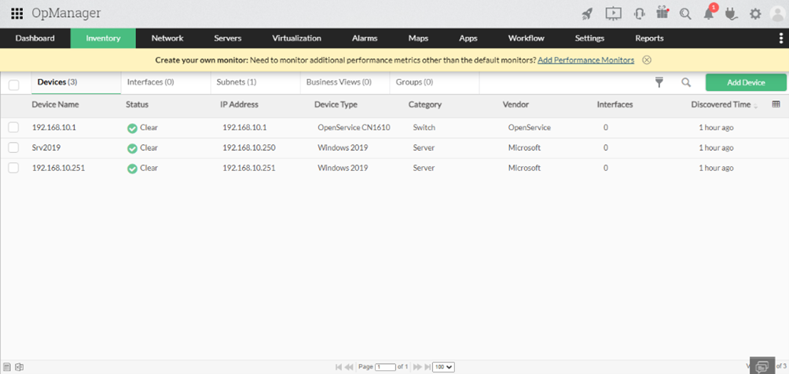
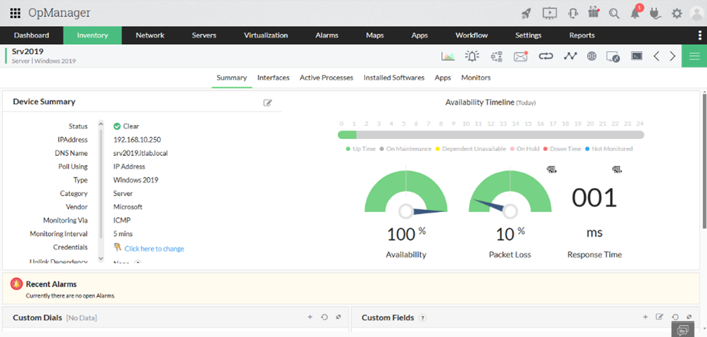

# 6. Quản lý hạ tầng với OpManager

## 6.1 Giới thiệu
**OpManager** là công cụ giám sát hạ tầng mạng do ManageEngine phát triển, cho phép:
- Phát hiện và giám sát trạng thái thiết bị (router, switch, server, VM).  
- Theo dõi hiệu suất tài nguyên (CPU, RAM, Disk, Network).  
- Tạo cảnh báo khi vượt ngưỡng (threshold alert).  
- Xây dựng dashboard trực quan để quản lý hệ thống.  

---

## 6.2 Triển khai
- Cài đặt OpManager trên Windows Server hoặc Linux.  
- Cấu hình SNMP community string để phát hiện thiết bị.  
- Tự động phát hiện (discovery) và nhóm thiết bị theo VLAN hoặc location.  
- Tạo profile cảnh báo để nhận email/SMS khi có sự cố.  

👉 Xem hướng dẫn chi tiết cài đặt tại: [install/opmanager_install.md](../install/opmanager_install.md)

---

## 6.3 Giao diện quản lý

  
**Hình 1**: Dashboard giám sát thiết bị mạng trong OpManager  

  
**Hình 2**: Cảnh báo sự cố hạ tầng trong OpManager  
- Status: Clear: Chỉ ra rằng thiết bị đang hoạt động bình thường, không có cảnh báo hoặc sự cố.
- IP Address: 192.168.10.250: Địa chỉ IP của thiết bị, cho phép theo dõi và quản lý kết nối mạng.
- DNS Name: srv2019.itlab.local: Tên DNS của thiết bị, giúp nhận diện thiết bị trong mạng nội bộ.
- Poll using: IP Address: Thiết bị được giám sát thông qua địa chỉ IP, đảm bảo theo dõi liên tục mà -không cần cấu hình phức tạp.
- Type: Windows 2019: Loại hệ điều hành đang chạy trên thiết bị là Windows Server 2019.
- Category: Server: Thiết bị này được phân loại là máy chủ trong hệ thống mạng.
- Vendor: Microsoft: Nhà cung cấp phần mềm cho thiết bị là Microsoft.
- Monitoring Via: ICMP: Theo dõi thiết bị thông qua giao thức ICMP (Internet Control Message Protocol), giúp kiểm tra tình trạng kết nối mạng và phản hồi từ thiết bị.

---

## 6.4 Use Case
- **Giám sát mạng**: phát hiện router/switch bị down.  
- **Giám sát server**: CPU cao, RAM đầy, disk quá tải.  
- **Cảnh báo tức thì**: gửi thông báo qua email/SMS cho admin.  
- **Báo cáo SLA**: theo dõi uptime/downtime hệ thống.  

---

## 6.5 Kết hợp với hệ thống
- Đồng bộ log sự cố với **Splunk** để phân tích toàn diện.  
- Kết hợp với **AD Tools** để quản lý hạ tầng + tài khoản người dùng.  
- Hỗ trợ đội vận hành (IT Ops) giám sát **toàn bộ hệ thống mạng SMEs**.  
