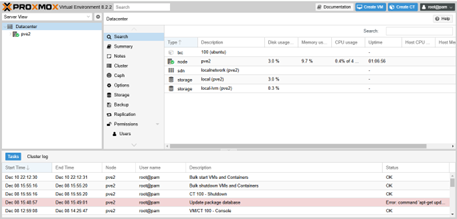

# 7. Ảo hóa máy chủ với Proxmox VE

## 7.1 Giới thiệu
**Proxmox Virtual Environment (VE)** là nền tảng ảo hóa mã nguồn mở, hỗ trợ:
- Ảo hóa bằng **KVM** cho máy ảo (VM).  
- Ảo hóa nhẹ bằng **LXC** cho container.  
- Quản lý tập trung nhiều node (cluster).  
- Tích hợp backup, HA (High Availability) và quản lý storage.  

---

## 7.2 Triển khai
- Cài đặt Proxmox trên máy chủ vật lý hoặc lab ảo hóa.  
- Cấu hình IP tĩnh cho Proxmox Node.  
- Tạo cluster nếu có nhiều node.  
- Thêm storage (local, NFS, Ceph, iSCSI).  
- Tích hợp backup và replication cho VM.  

hướng dẫn cài đặt tại: [install/proxmox_install.md](../install/proxmox_install.md)

---

## 7.3 Giao diện quản lý

  
**Hình 1**: Dashboard quản lý node trong Proxmox  

---

## 7.4 Use Case
- **Ảo hóa server doanh nghiệp**: AD, DNS, Splunk, OpManager.  
- **Phân chia tài nguyên**: CPU, RAM, Disk cho từng VM.  
- **Triển khai container** để chạy dịch vụ nhẹ (web server, syslog).  
- **Backup & khôi phục nhanh** trong trường hợp sự cố.  

---

## 7.5 Kết hợp với hệ thống
- Chạy **Security Onion, OPNsense, Splunk** trên VM Proxmox.  
- Hỗ trợ nhân viên **remote work** qua VPN + VM.  
- Tối ưu chi phí hạ tầng cho doanh nghiệp SMEs.  
